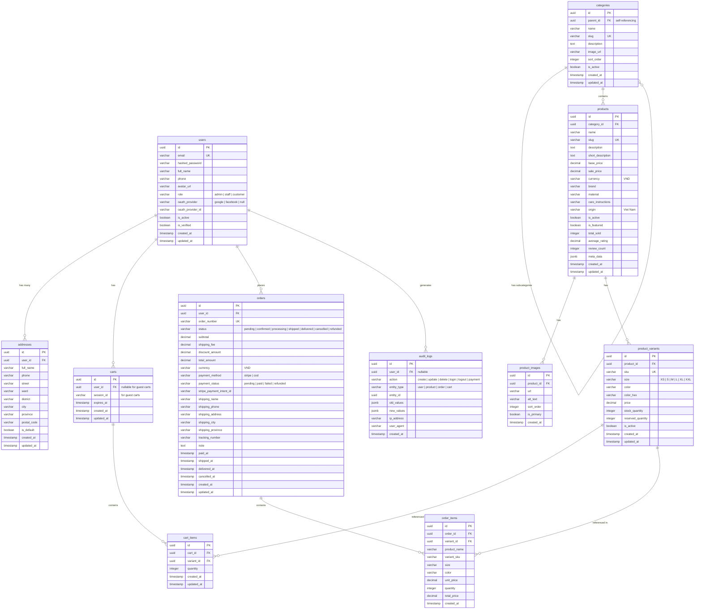

# ER Diagram -- VN Fashion Shop

So do thuc the - quan he / Entity-Relationship Diagram

## Mermaid Diagram

## Mo ta bang / Table Descriptions

### users
Luu tru thong tin nguoi dung, bao gom xac thuc va OAuth.
Stores user information including authentication and OAuth data.

### addresses
Dia chi giao hang cua nguoi dung. Moi nguoi dung co the co nhieu dia chi.
Shipping addresses for users. Each user can have multiple addresses.

### categories
Danh muc san pham, ho tro danh muc con (self-referencing).
Product categories, supports subcategories via self-referencing.

### products
Thong tin san pham thoi trang bao gom gia, mo ta, va thong tin xuat xu.
Fashion product information including price, description, and origin.

### product_images
Hinh anh san pham, ho tro nhieu hinh moi san pham.
Product images, supports multiple images per product.

### product_variants
Bien the san pham theo kich co va mau sac, quan ly ton kho theo tung bien the.
Product variants by size and color, inventory managed per variant.

### carts
Gio hang, ho tro ca khach dang nhap va khach vang lai (session-based).
Shopping carts, supports both logged-in users and guest carts (session-based).

### cart_items
Cac mat hang trong gio hang, lien ket toi bien the san pham cu the.
Cart line items, linked to specific product variants.

### orders
Don hang bao gom trang thai, thanh toan, va thong tin giao hang.
Orders including status, payment, and shipping information.

### order_items
Chi tiet don hang. Luu tru gia va thong tin san pham tai thoi diem dat hang (snapshot).
Order line items. Stores price and product info at time of purchase (snapshot).

### audit_logs
Nhat ky hoat dong he thong phuc vu kiem soat va bao mat.
System activity logs for auditing and security purposes.
